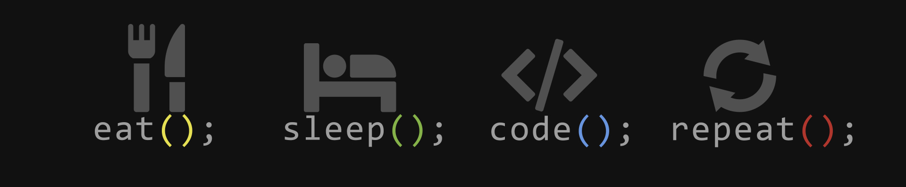

<h1 align="center">Hi 👋, I'm Vikraman R</h1>
<h3 align="center">A Passionate Java Programmer and Frontend Developer.</h3>

<!--  -->
 
 

-  I’m currently learning **Javascript**

-  Ask me about **Java**

-  Reach me at  **vikramanjosephite@gmail.com**

-  Fun fact **I am a Gamer**

 

<h3 align="left">Languages and Tools:</h3>

 
 
 
 

 

 

<h3 align="left">Connect with me:</h3>

 

&nbsp;

<!--  -->

<!-- My Sql default image  Alternate Image link - https://upload.wikimedia.org/wikipedia/commons/b/b2/Database-mysql.svg -->

<!-- Android default image  -->

